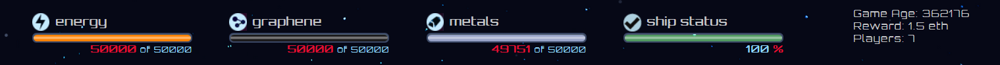
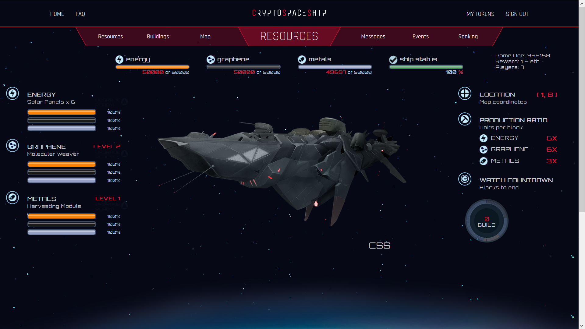
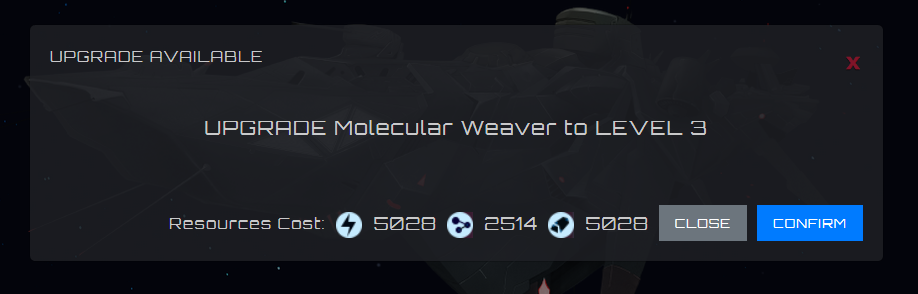
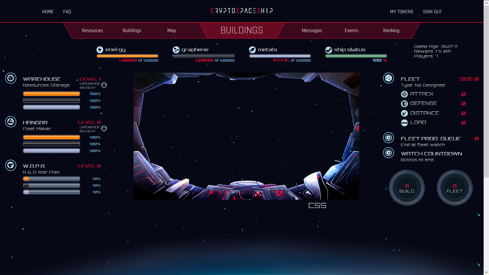
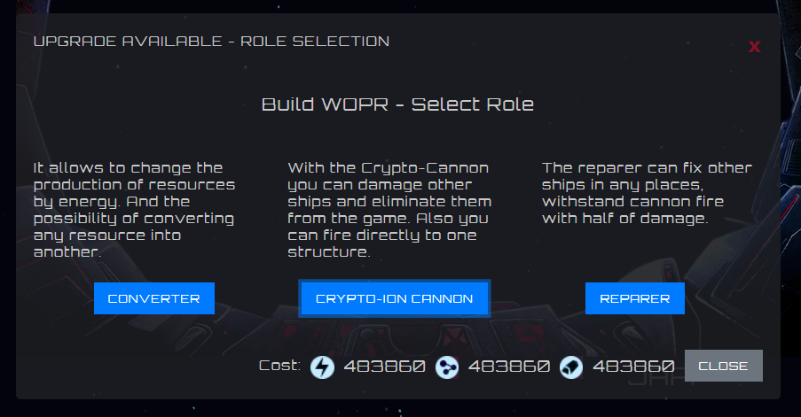
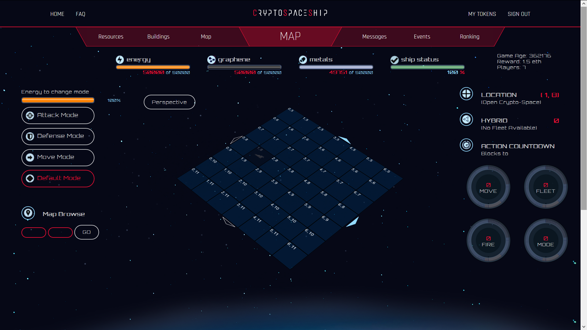
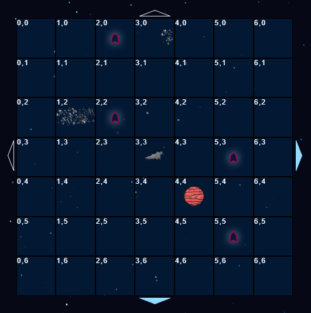
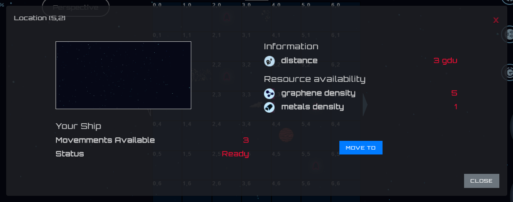
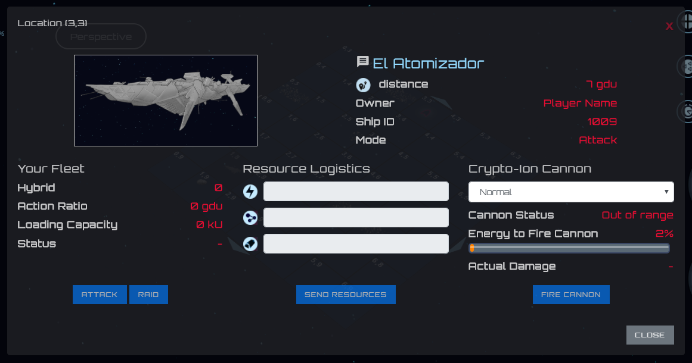
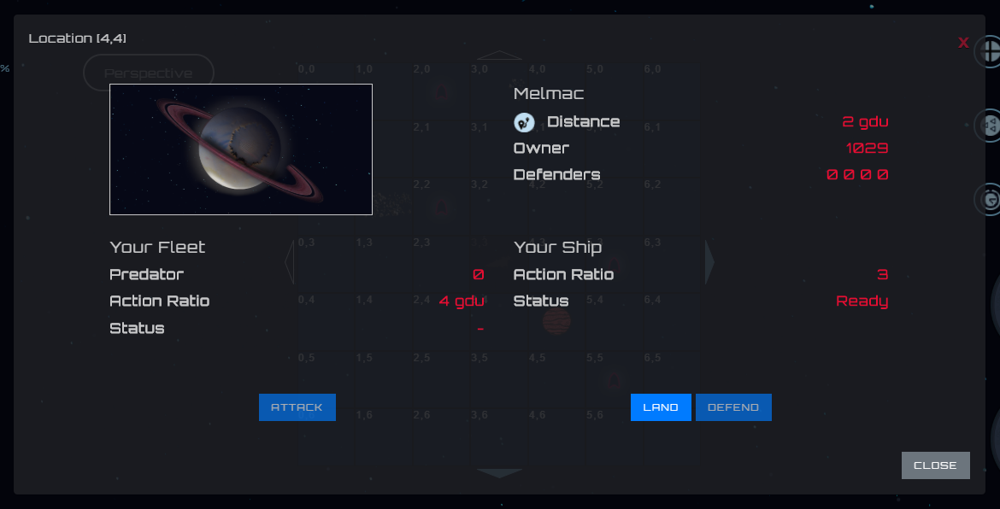

###############
Centro de Mando
###############

Todo capitan de una Crypto-space Ship tiene que saber como hacerla evolucionar, ganar batallas y surcar el crypto-espacio.

*********************
Indicadores Generales
*********************

Los siguiente indicadores estan siempre presentes e informan lo siguiente:

1. Cantidad de **Energia** acumulada sobre la cantidad que puede almacenar actualmente. ( **acumulado** of **capacidad** )

2. Cantidad de **Grafeno** acumulado sobre la cantidad que puede almacenar actualmente

3. Cantidad de **Metales** acumulado sobre la cantidad que puede almacenar actualmente

4. Estado de la Crypto-space Ship. **100%** indica que se encuentra en optimas condiciones.

.. hint::
    Cuando el recurso acumulado es igual a la cantidad que la Crypto-space ship puede almacenar actualmente y la produccion de cada recurso es mayor a 0, se estan desperdiciando recursos. **Se recomienda gastar o de ser posible ampliar el almancen**.

********
Recursos
********

A continuacion se presenta la vista de Recursos.

Sección Izquierda
=================

Se puede observar el nivel de:

1. Los paneles Solares

2. Recolector de Grafeno

3. Recolector de Metales

Las barras indican la cantidad de recursos disponibles para ampliar al proximo nivel. El color amarillo representa a la energia, el color negro al grafeno y el gris a metales.

El boton intermitente **UPGRADE READY** indica que se tienen los recursos necesario para ampliar de nivel y que no hay nada contruyendo, ya que no se permiten ampliaciones simultaneas. Al presionarlo se puede observar la cantidad re recursos necesarios para la actualiacion y al presionar el boton **Confirm** se envia la orden de construccion.

Una vez que se confirma, se descuentan los recursos y empieza su actualizacion.

Sección Derecha
===============

Sobre este espacio se puede observar:

1. **Location**: Coordenada donde se encuentra la Crypto-space Ship

2. **Production Ratio**: La produccion de recursos por bloque

3. **Watch countdown**: La cuenta regresiva que muestra la cantidad de bloques restantes para terminar la actualizacion.

Opcionalmente pueden aparecer otros botones intermintes desbloqueando ciertas caracteristicas, como por ejemplo la opcion de prender el conversor de recursos y la opcion de convertir recursos.

.. note::
    **La unidad de medida de tiempo son los bloques**

**************
Construcciones
**************

Vista del panel de construcciones internas

Sección Izquierda
=================

Al igual que en la vista de recursos, se puede observar el nivel de las siguientes estructuras

1. Almacen

2. Hangar

3. W.O.P.R

Las barras indican la cantidad de recursos disponibles para ampliar al proximo nivel. El color amarillo representa a la energia, el color negro al grafeno y el gris a metales.

El boton intermitente **UPGRADE READY** indica que se tienen los recursos necesario para ampliar de nivel y que no hay nada contruyendo, ya que no se permiten ampliaciones simultaneas. Al presionarlo se puede observar la cantidad re recursos necesarios para la actualiacion y al presionar el boton **Confirm** se envia la orden de construccion.

Al momento de ampliar el W.O.P.R de nivel 0 a nivel 1, ademas se tiene que seleccionar el rol de W.O.P.R entre:

1. Converter

2. Crypto-Ion Cannon

3. Reparer

Sección Derecha
===============

En esta sección se puede encontrar infomacion sobre la configuracion de la flota de drones de combate (**fleet**).

1. **Fleet**: Informacion sobre la flota de drones

    - El numero de drones que compone la flota
    
    - Las caracteristicas de la flota, es decir, puntos de ataque, defensa, distancia y carga. En el caso de que la flota este diseñada. Al construir el hangar en nivel 1 ya aparece el boton intermintente **DESIGN FLEET** y luego que este diseñada **BUILD MORE**.

    - La otra opcion que se activa dadas ciertas circunstancias es el boton intermitente **DISASSEMBLE FLEET** para destruir la flota actual.

2. **Fleet Prod. Queue**: La cantidad de drones que se encuentran en la cola de construccion.

4. **Watch countdown**: Los relojes de cuenta regresiva

    - **BUILD**: Cuantos bloques faltan para finalizar la ampliacion del almace, hangar o wopr.

    - **FLEET**: Bloques restantes para la finalizacion de la construccion de la flota de drones.

***
Map
***

La sección estrategica por excelencia, donde los grandes comandantes se forjan y nacen las leyendas.

Sección Izquierda
=================

En esta parte se puede encontrar la barra que indica la energia necesaria para poder pasas la Crypto-space Ship de modo.
Luego los distintos botones para pasar de modo. Indicando con otro color el modo en que se encuentra actualmente.

Finalmente podemos poner unas coordenadas en **Map Browse** para poder explorar una posicion en el mapa.

Sección Central
===============

En esta sección encontramos el mapa estrategico de 7x7 casilleros cada una representado por una coordenada. En el centro, de se posible, se encuentra la Crypto-space ship que estamos comandando. 
tambien podemos identificar otros objetos tales como:

- **Planetas**

- **Cinturones de Asteroides**

- **Otras Crypto-space ships**

- **Coordenadas vacias**

Coordenedas vacias
------------------

Al inspeccionar una posicion vacia, podemos obsevar infomacion sobre la misma. La densidad de recursos, tanto de grafeno como de metales; como asi tambien la distancia a la que se encuentra.
Si esta habilitada la opcion **Mode To** podemos desplazar la Crypto-space Ship hacia esa posicion.

.. hint::
    La disponibilidad de recursos varia en las distintas posiciones, es conveniente buscar un lugar con alta densidad de recursos. Una alta densidad implica una mayor produccion, una evolucion mas rapida hace la Crypto-space Ship mas poderosa en menor tiempo.

Otras Crypto-space Ships
------------------------

Cuando se selecciona otra Crypto-space Ship, se puede observar informacion de la misma.

- **Name**: Rempresenta el nombre de la obra nave, se puede enviar un mensaje al capitan de esta nave al apretar sobre el nombre.

- **Distance**: La distancia entre las dos Crypto-space ship medida en **gdu**

- **Mode**: El modo en que se encuentra la nave. Esta informacio es muy útil si se pretende atacarla.

Para atacar a la nave seleccionada primero se deben cumplir ciertar condiciones

1. Tener una **flota de drones**

2. La flota debe estar lista para la accion. Si la flota estuvo recientemente en accion, hay que esperar los bloques restante para su reparacion y reaprovisionamiento.

3. La otra Crypto-space Ship debe estar a una distanca en rango de acuerdo al diseño de la flota.

Al cumplirse las condiciones anteriormente descriptas, se habilitan los botones **Attack** y **Raid**. Ambas acciones realizan una accion belica sobre la otra Crypto-space Ship pero con la diferencia que **Attack** intenta destruir todas las naves y luego robar recursos, en cambio **Raid** intenta robar recursos tratando de salva la mayor cantidad de drones de la refriega.

**Send resources** permite enviar recursos a la otra Crypto-space Ship, se tienem que cumplir los mismos requisitos que para entablar una batalla. La cantidad que se puede enviar depende del diseño de los drones y la cantidad que conforme la flota.

.. note::
    La cantidad de bloques necesarios para el reaprovisionamiento de los drones es mucho mayor al atacar que al enviar recursos a otras Crypto-space Ships.

De acuerdo al rol seleccionado al ampliar el **W.O.P.R** se puede habilitar la opcion de disparar el Crypto-Ion cannon o reparar la Crypto-space Ship, en caso de haber seleccionado **Crypto-Ion Cannon** o **Reparer**.

Al disparar el Crypto-Ion cannon, se puede elegir entre dos modos de disparo:

- **Normal**: Provocando daño a toda la Crypto-space Ship

- **Accuracy**: Provocando daño solamente a la estructura seleccionada, destruyendo los niveles correspondientes al nivel de actualizacion del Crypto-Ion Cannon.

Planetas
--------

Cuanto se selecciona un planeta se disponibilizara la informacion del mismo.

- El nombre con que se conoce al planeta

- La distancia a la que se encuentra

- El dueño del planeta

- Las Cryto-space Ships que se encuentran defendiendolo

.. note::
    Los planetas son defendidos por nativos antes de la primer conquista. Nunca se debe subertimar el poder de estos.

El boton **Attack** estara disponible en caso de que la flota de drones este lista para el combate, el planeta se puede atacar para intentar debilitar a los defensores o directamente intentar la conquista.

Si la intencion es defender el planeta, se puede ocupar una de las 4 posiciones defensivas, es necesario contar con drones para que **Defend** esta habilitado.

Para poder aterrizar basta con presionar el boton **Land** que se disponibilizara en caso de que la Crypto-space Ship esta a distancia y los motores esten listos para el siguiente movimiento.

.. hint::
    Al aterrizar en un planeta **la produccion de grafeno y metales es nula**, pero es una excelente opcion para escapar de un enemigo. Al aterrizar en un planeta no hay forma de ser atacado.

Sección Derecha
===============

- **Location** nos indica las coordenadas de la posicion de la Crypto-space Ship en el mapa

- **Hybrid**, **Predator**, **Keeper**, **Galleon** o **Interceptor** indica el tipo de drones de combate que tenemos y la cantidad disponible de los mismos. Debajo en que estado se encuentran: **Ready for battle** o **Waiting**. 

- **Action Countdown** la cantidad de bloques necesarios para

    - **Move**: realizar un movimiento de la Crypto-space Ship. Esto se debe a que los motores se deben cargar para poder realizar el proximo salto.

    - **Mode**: poder cambiar de modo nuevamente.

    - **Fleet**: para poder utilizar nuestra flota nuevamente, ya sea para enviar recursos o para atacar una Crypto-space Ship enemiga. Hay que considerar que luego de un ataque o de un viaje, los drones necesitan reparaciones y recarga de energia.

    - **Fire** o **Repare**: La espera para poder realizar otra reparacion o dispario de cañon. Este contador depende del rol elegido al momento de actualizar el WOPR a nivel 1.

********
Mensajes
********

Es la manera que tienen las Crypto-space Ship para comunicarse entre si. Al instante de escribir un mensaje el capitan de la otra Crypto-space Ship ya puede leerlo.
Solamente es necesario saber el nombre de la otra Crypto-space Ship a la hora de redactar el mensaje.

*******
Eventos
*******

