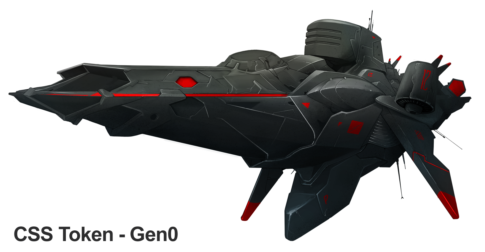
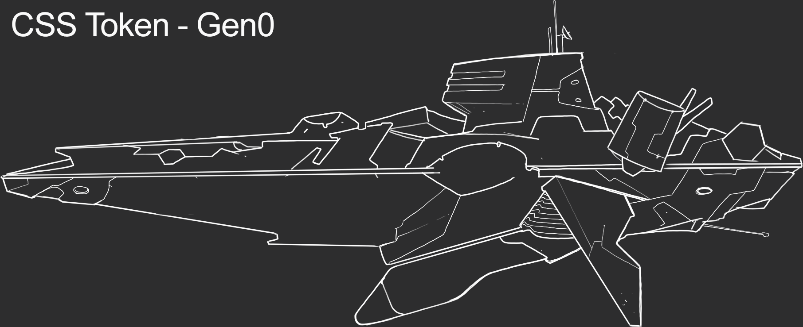
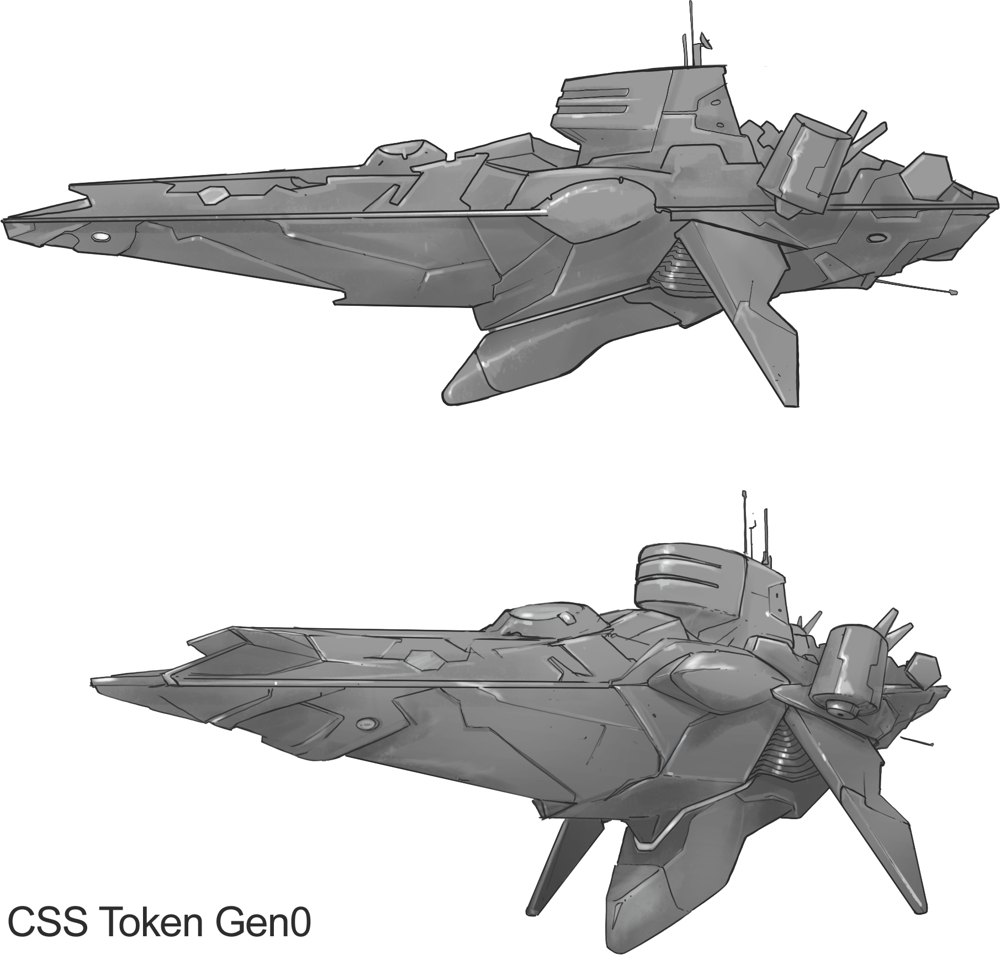
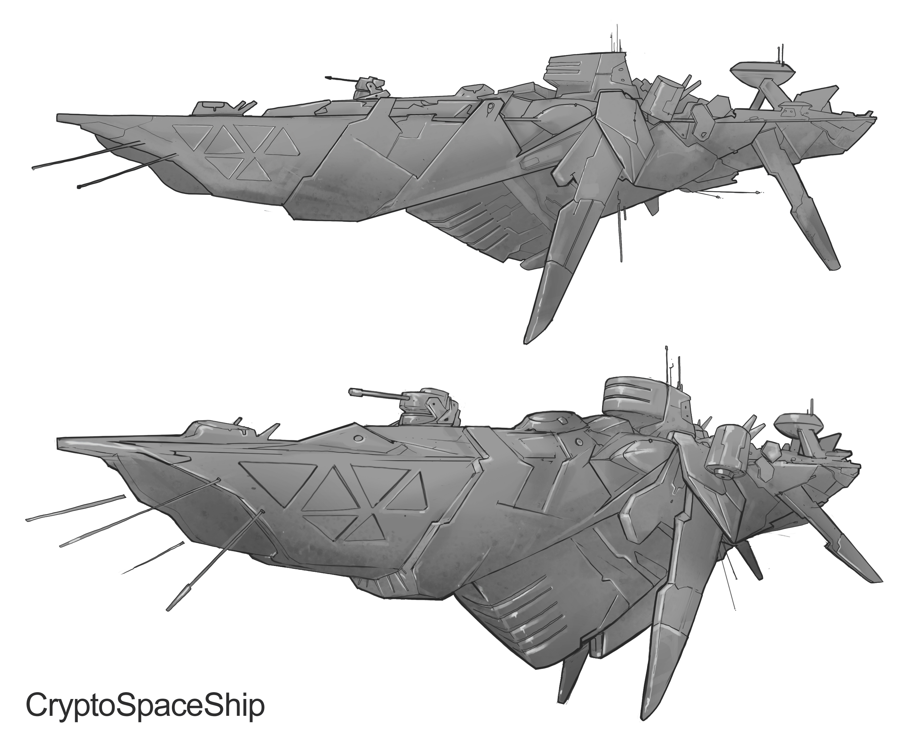

#################
Crypto-space Ship
#################

.. image:: cryptospaceship.png
    :width: 400px
    :alt: CryptoSpaceShip
    :align: center

Las Crypto-space Ships son poderosas fortalezas autosuficientes que pueden surcar el espacio imponiendo respeto a su paso. Está compuesta por el módulo de mando y el casco, **CSS Token** y **CSS Hull** respectivamente.

*********
CSS Token
*********

Descripción 
===========

CSS Token es el modulo de mando de las Crypto-space Ship. Estos modulos de comando poseen procesadores de habilidades llamados
QAIM (Quantum Artificial Intelligence Module). A medida que un CSS Token participa en distintos escenarios belicos, los procesadores QAIM 
son entrenados, lo que permite mejorar el rendimiento en las próximas misiones y teatros de operaciones. 

Cada CSS Token tiene características propias de la generación y características generales. Sin importar la generación, se puede diferenciar por:

- Nombre
- Color
- Generación
- NFT #id

.. note::
    La generacion actual de los CSS Token es: **Gen 0**

Características de la generación actual 
=======================================

- Generación: Gen 0

- Tripulación: 600 

- Nivel inicial: 0

- Límite de Entrenamiento: 1000 puntos

- Capacidad de entrenamiento: 5 puntos por nivel

- QAIMs: 6

::

    QAIMs
    1. Puntos de Flota
    2. Mejora Recursos
    3. Mejora Construcciones
    4. Mejora de Flota
    5. Mejoras en Salto GDU
    6. Mejoras cambio de Modo

.. note:: 
    El **Limite de Entrenamiento** establece la cantidad de puntos necesarios para poder subir de nivel y poder disponibilizar la **Capacidad de entrenamiento**

.. hint::
    Una vez que los puntos QAIM son distribuidos no hay manera de volver atrás. Piensa bien tus elecciones de acuerdo al rumbo que quieras para su CSS Token.

********
CSS Hull
********

Descripción 
===========

El CSS Hull es el componente que junto al CSS Token forman una Crypto-space Ship. Este módulo descartable solamente se utiliza para un tetro de operaciones, dando posibilidad al CSS Token de aventurarse en el crypto-space convirtiéndola en una verdadera nave nodriza y fortaleza andante.
Todos los CSS Hull al momento de conectarse tienen todas sus estructuras en un nivel basico que deben ir progresando de nivel para hacerse más poderosa.

.. image:: csssocket.png
    :width: 400px
    :alt: Conexion CSS Token y CSS Hull
    :align: center

.. note::
    La generación actual de los CSS Hull es: **Gen 0**

Características de la generación actual 
=======================================

- Cuenta con dos motores CryIon-2 que permiten un salto de hasta 6 gdu

- Almacenamiento de recursos 

- Espacio para hasta 520 drones de combate

- 2 Conectores QAIM

- 4 Modos de comportamiento. Ataque, Defensa, Movimiento y Normal

.. note::
    La generacion **Gen 0** tiene una interfaz de 2 QAIM con el módulo CSS Token. Es decir si el CSS Token tiene más QAIMs, como máximo se van a poder conectar con dos de ellos.
    

Estructuras Productivas
=======================

En el **Crypto-Space** existen 3 elementos: Energía, Grafeno y Metales. Todas las actualizaciones en la Crypto-space Ship requiren cierta cantidad de recursos para su construcción.

A continuación se detallan las estructuras de producción:

- **6 Paneles solares**: Los paneles solares absorven enegía de la estrella más cercana. Cada uno de los paneles solares se puede actualizar desde el nivel 1 al nivel 10

- **1 Recolector de Grafeno**: Como bien lo dice el nombre, este módulo recolecta y procesa el grafeno que está desperdigado en el crypto-espacio. El recolector de grafeno se puede actualizar desde el nivel 1 al nivel 10. Produciendo en el primer nivel 1 grafeno por densidad y en el último nivel 40 grafeno por densidad.

- **1 Recolector de Minerales**: Este módulo recolecta los metales que existen en cada cuadrante. Se puede actualizar desde el nivel 1 al nivel 10. Produciendo en el primer nivel 1 grafeno por densidad y en el último nivel 40 grafeno por densidad.

.. hint::
    Desarrollar primero estas estructuras productivas le pueden dar la ventaja ya que una nave desarrollada economicamente es una nave poderosa.

.. note::
    La producción de energía no depende de la posición donde se encuentre la Crypto-space Ship ya que no depende de la distancia a la estrella más cercana. En el caso del grafeno y los metales cada coordenada del crypto-space tiene una densidad distinta. 
    Actualmente la variación de la densidad de los distintos elementos es un tema de estudio.

A continuación se detalla el calculo de produccion:

::

    pe = d * N
    Siendo
        pe = Producción
        d = Densidad del recurso en la posición
        N = La cantidad que produce un recolector en un nivel dado.

Estructuras Internas
====================

- **Almacen**: 4 niveles con distinta cantidad de almacenaje en cada actualización. 

- **Hangar**: 4 niveles. Cada nivel agrega mayor cantidad de puntos de flota y la cantidad de recursos que se disponibilizan a la hora de des ensamblar la flota de drones de combate.

- **W.O.P.R**: El wopr es el espacio de construcción en el CSS Hull que permite elegir entre los siguientes dispositivos.

    1. **Crypto-Ion Cannon**: Cañón que permite dos modalidades de disparo, normal y punteria. El modo normal ataca a toda la Crypto-space Ship subiendo el daño general, lo que provoca una disminución proporcional de la producción y de los tiempos de construcción y preparación para las acciones generales de la Crypto-space Ship (movimientos, cambio de modo, disparos). El modo punteria permite apuntar y dañar a una estructura en particular y genera daño.

    2. **Reparer**: Módulo especial que permite repararse y reparar a otras Crypto-space Ship del daño provocado por los disparos de cañón. Además cuenta con un escudo que atenúa el daño de los disparos. 

    3. **Resource Converter**: Este módulo permite convertir en tiempo real la producción de grafeno y metales en producción de energia, ademas de poder convertir del stock cualquier recurso en otro.

Modos de nave
=============

La generación actual de CSS Hull posee 4 modos, cadad uno con sus respectivas penalizaciones y bonificaciones con excepción del modo normal.

Modo Ataque
-----------

+-----------------------------------+-------------------------------------------------------+
| Bonificacion/Penalizacion         | Descripción                                           |
+===================================+=======================================================+
| +25%                              | Poder de ataque de la flota de Drones                 |
+-----------------------------------+-------------------------------------------------------+
| +50%                              | Rango de ataque para la flota de Drones               |
+-----------------------------------+-------------------------------------------------------+
| -5%                               | Podes de defensa de la flota de Drones                |
+-----------------------------------+-------------------------------------------------------+
| -25%                              | Rango de movimiento de la Crypto-space Ship           |
+-----------------------------------+-------------------------------------------------------+

Modo Defensa
------------

+-----------------------------------+-------------------------------------------------------+
| Bonificacion/Penalizacion         | Descripción                                           |
+===================================+=======================================================+
| +30%                              | Poder de defensa de la flota de Drones                |
+-----------------------------------+-------------------------------------------------------+
| -10%                              | Poder de ataque de la flota de Drones                 |
+-----------------------------------+-------------------------------------------------------+
| -100%                             | Rango de movimiento de la Crypto-space Ship           |
+-----------------------------------+-------------------------------------------------------+

Modo Movimiento
---------------

+-----------------------------------+-------------------------------------------------------+
| Bonificacion/Penalizacion         | Descripción                                           |
+===================================+=======================================================+
| +50%                              | Rango de movimiento de la Crypto-space Ship           |
+-----------------------------------+-------------------------------------------------------+
| -10%                              | Poder de ataque de la flota de Drones                 |
+-----------------------------------+-------------------------------------------------------+
| -10%                              | Poder de defensa de la flota de Drones                |
+-----------------------------------+-------------------------------------------------------+

Flota de drones
===============

Cada drone activo consume 1x de energía disminuyendo la producción, como consecuencia se puede tener tantos drones activos segun la cantidad de energia que produce la Crypto-space Ship. 
El diseño de los drones consiste en la distribución de los puntos disponibles de acuerdo al nivel de hangar. 

.. hint::
    Los drones se pueden diseñar y rediseñar en cualquier momento, el único requisito es no tener ningún dron activo. Se puede también destruir los drones activos con el fin de rediseñar. A partir del nivel 2 de hangar, al destruir drones activos parte de los recursos se reciclan y vuelven al stock.

Los puntos para el diseño de drones se pueden distribuir en las siguientes características:

    1. **Ataque**: Puntos de ataque de cada dron
    2. **Defensa**: Puntos de defensa de cada dron
    3. **Carga**: Capacidad de carga de cada recurso
    4. **Distancia**: Rango de ataque

De acuerdo a la distribución de los puntos existen 5 distintos tipos de drones:

    - **Predator**: Su mayor característica es el ataque
    - **Keeper**: Su mayor característica es la defensa
    - **Interceptor**: Su mayor característica es el rango de ataque
    - **Galleon**: Su mayor característica es la cantidad de recursos que puede transportar
    - **Hybrid**: No tiene una característica sobresaliente

.. note::
    No pueden coexistir en el mismo momento dos o mas tipos de drones. Si la estrategia cambia, es necesario re diseñar y construir nuevos tipos de drones.

.. hint::
    Los drones no solamente sirven para la guerra, sino también para enviar recursos a una nave aliada, es necesario que los drones tengan puntos de **distancia** y de **carga**.

   

