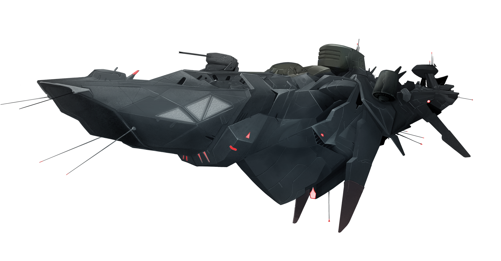
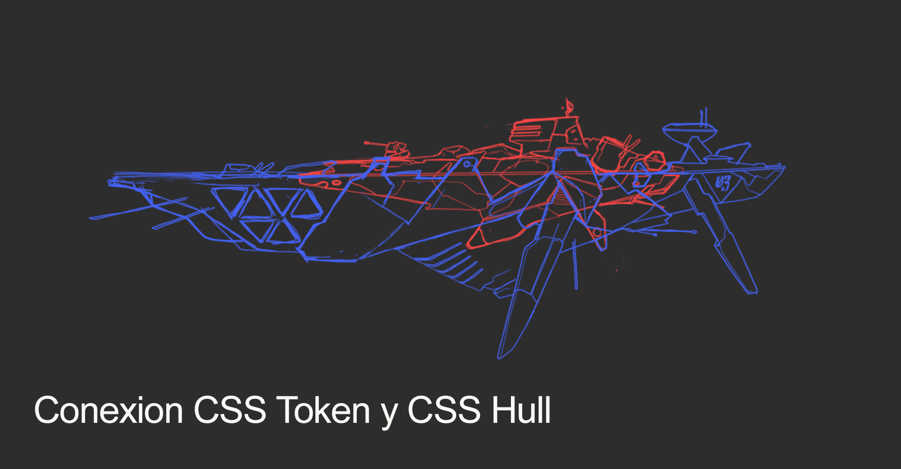

CSS Hull
========

Descripción 
-----------

El CSS Hull es el componente que junto al CSS Token forman una CryptoSpaceShip. Este modulo descartable solamente se utiliza para un tetro de operaciones dandole la posibilidad al CSS Token de aventurarse en el crypto-space convirtiendola en una verdadera nave nodriza.
Todos los CSS Hull al momento de conectarse tienen todas sus estructuras en un nivel basico que deben ir progresando de nivel para hacerse mas poderosa.

.. note::
    La generacion actual de los CSS Hull es: **Gen 0**

Caracteristicas de la generación actual 
---------------------------------------

- Cuenta con dos motores CryIon-2 que permiten un salto de hasta 6 gdu

- Almacenamiento de recursos 

- Espacio para hasta 520 drones de combate

- 2 Conectores QAIM

- 4 Modos de comportamiento. Ataque, Defensa, Movimiento y Normal

.. note::
    La generacion **Gen 0** tiene una interfaz de 2 QAIM con el modulo CSS Token. Es decir si el CSS Token tiene mas QAIMs, como maximo se van a poder conectar con dos de ellos.
    

Estructuras Productivas
-----------------------

- **6 Paneles solares**: Cada uno de los paneles solares se puede actualizar desde el nivel 1 al nivel 10

- **1 Recolector de Grafeno**: El recolector de grafeno se puede actualizar desde el nivel 1 al nivel 10. Produciento en el primer nivel 1 grafeno por densidad y en el utimo nivel 40 grafeno por densidad.

- **1 Recolector de Minerales**: El recolector de metales se puede actualizar desde el nivel 1 al nivel 10. Produciendo en el primer nivel 1 grafeno por densidad y en el ultimo nivel 40 grafeno por densidad.

.. hint::
    En el **Crypto-Space** existen 3 elementos: Energia, Grafeno y Metales. La produccion de energia no depende de la posicion donde se encuentre la CryptoSpaceShip ya que no depende de la distancia a la estrella mas cercana. En el caso del grafeno y los metales cada coordenada del crypto-space tiene una densidad distinta. 
    Actualmente la variacion de la densidad de los distintos elementos es un tema de estudio.

A continuacion se detalla el calculo de produccion.

::

    pe = d * N
    Siendo
    - pe = Produccion
    - d = Densidad del recurso en la posicion
    - N = La cantidad que produce un recolector (ya sea de grafeno o metales) en un nivel dado.

Estructuras Internas
--------------------

- **Almacen**: 4 niveles con distinta cantidad de almacenaje en cada upgrade

- **Hangar**: 4 niveles. Cada nivel agrega mayor cantidad de puntos de flota y la cantidad de recursos que se disponibilizan a la hora de des ensamblar la flota.

- **W.O.P.R**: El wopr es el espacio de construccion en el CSS Hull que permite elegir entre los siguientes dispositivos

    1. **Crypto-Ion Cannon**: Cañon que permite dos modalidades de disparo, normal y punteria. El modo normal ataca a toda la CryptoSpaceShip subiendo el daño general, lo que provoca una disminucion proporcional de la produccion y de los tiempos de construccion y preparacion para las acciones generales de la CryptoSpaceShip (movimientos, cambio de modo, disparos). El modo punteria permite apuntar y dañar a una estructura en particular y genera daño.

    2. **Reparer**: Modulo especial que permite repararse y reparar a otras CryptoSpaceShip del daño provocado por los disparos de cañon. Ademas cuenta con un escudo que atenúa el daño de los disparos. 

    3. **Resource Converter**: Este modulo permite convertir en tiempo real la producion de grafeno y metales en produccion de energia, ademas de poder convertir del stock cualquier recurso en otro.

   

